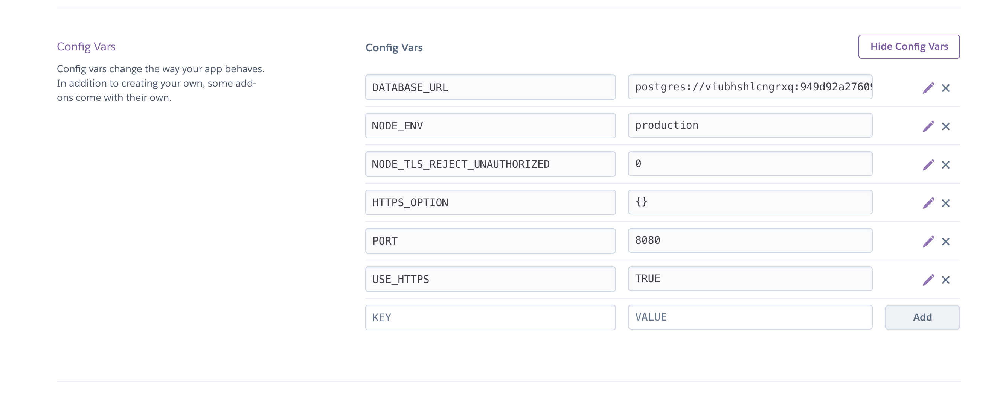
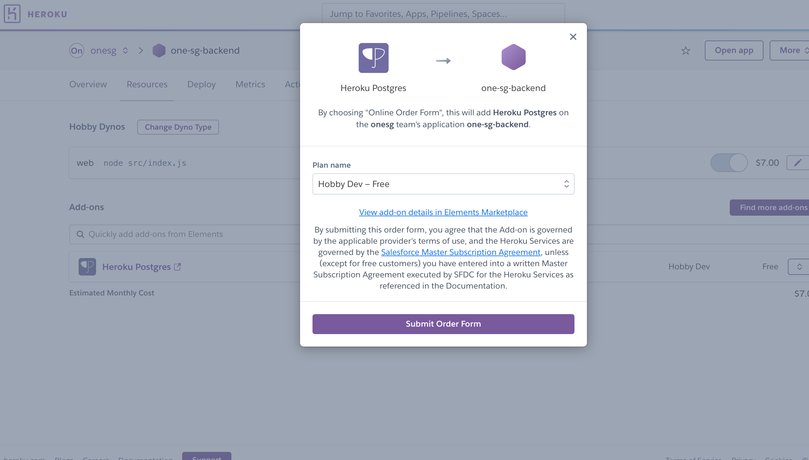
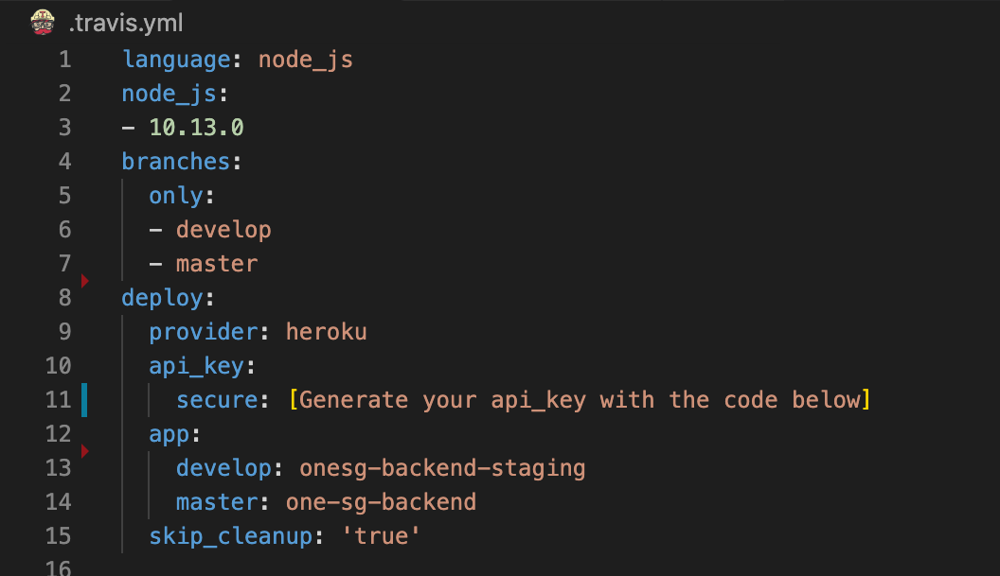
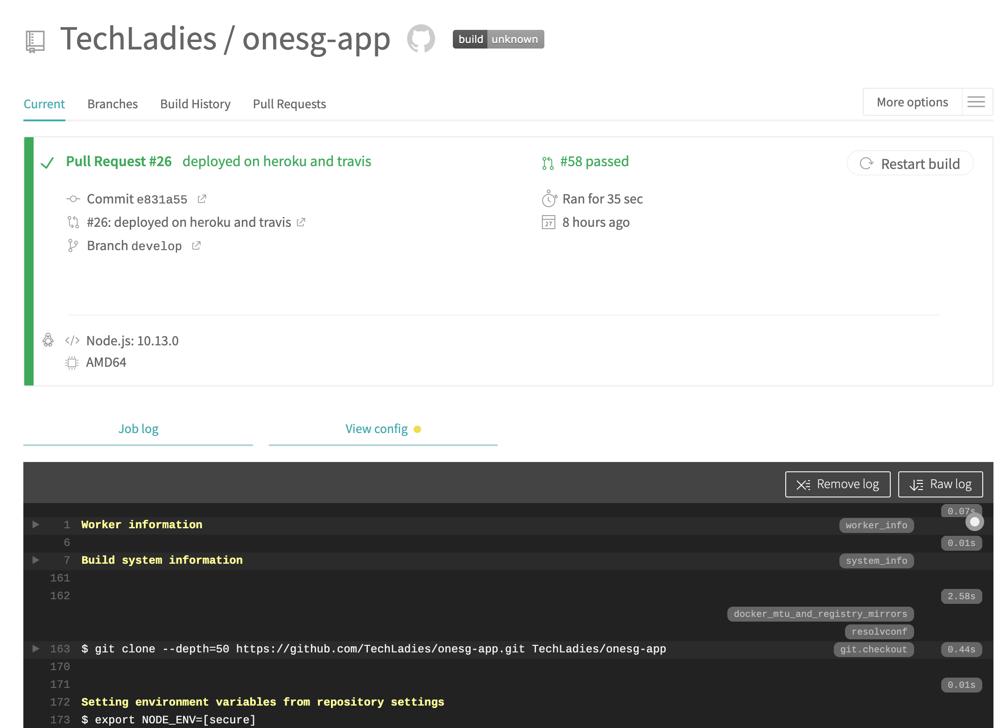
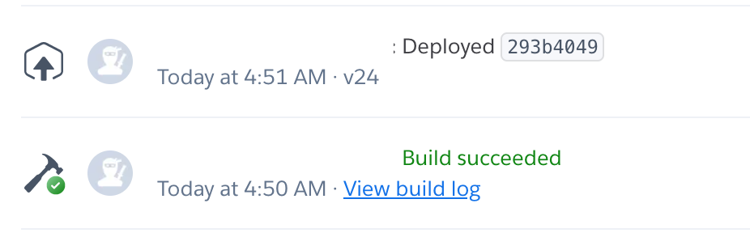
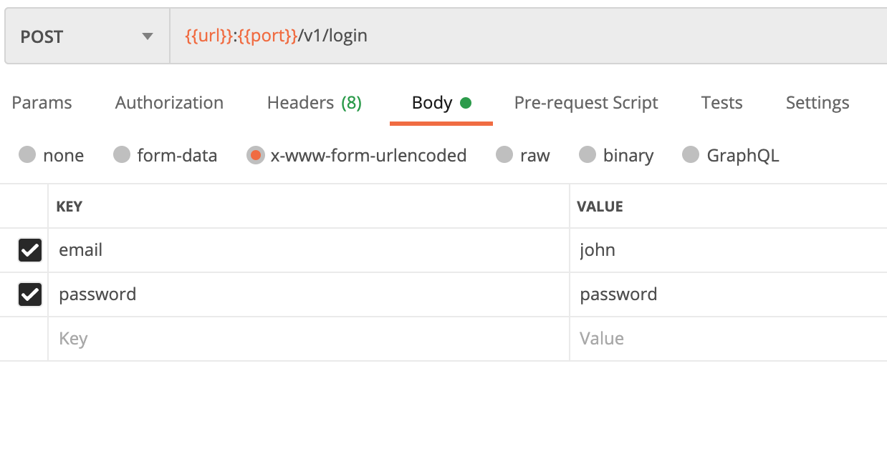
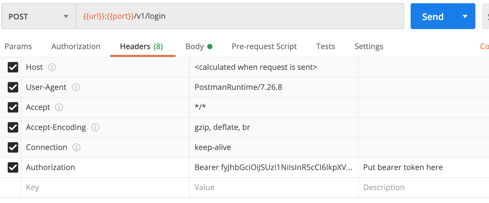

# OneSG App

This is an application that is made for [OneSG](http://onesingapore.org/), that aims to provide a centralised platform for users to access, create and update cases.

The development of this application was done as part of [Techladies Bootcamp #6](https://github.com/TechLadies/bootcamp6-info). [Techladies](http://www.techladies.co/) is a community for women in Asia to connect, learn, and advance as programmers.

<br/>
<br/>

## Table of Contents

- [Requirements](#requirements)
- [Installation](#installation)
- [Database Setup](#database-setup)
- [Setup Keys for Passport](#setup-keys-for-passport)
- [Project Structure](#project-structure)
- [Deployment](#deployment)
- [Manual Deployment](#manual-deployment)
- [Login](#login)

<br/>
<br/>

## Requirements

- node v12.18.3
- npm v6.14.6
  <br/>
  <br/>

## Project Structure

## Installation

Code and setup instructions for frontend and backend can be accessed in their respective subdirectories.

1. Install dependencies

```
git clone https://github.com/TechLadies/onesg-app.git
npm install
```

2. Get development.js file from the coaches/team lead and put in config > env
3. Run the application

```
npm run dev
```

4. Go to http://localhost:8080

<br/>
<br/>

## Database Setup

1. Install PostgreSQL:

```
npm install pg
```

2. Create the database

```
createdb onesg
```

3. To run the migrations,

```
npm run db-migrate
```

4. Populate the tables with the seed data (in the following sequence due to foreign key restraints)

```
npx knex seed:run --specific=staff.js
npx knex seed:run --specific=beneficiaries.js
npx knex seed:run --specific=referees.js
npx knex seed:run --specific=tag.js
npx knex seed:run --specific=case.js
npx knex seed:run --specific=requestType.js
npx knex seed:run --specific=request.js
npx knex seed:run --specific=comments.js
```

Ensure that the database `onesg` exists in the localhost, with the tables populated with the seeded data. You can download Postico or the Postgres.app to check.

5. Install psql and pg_trgm

```
\c onesg;
```

psql;

```
CREATE EXTENSION pg_trgm;
```

<br/>

## Setup Keys for Passport

To create keys required for authentication with `passport`, run the following command,

```
npm run generate-keys
```

You should now have the generated public & private keys in a `keys` folder in root.

<br/>

## Project Structure

```
onesg-app
+- config/ : configuration folder
|  +- env/
|  |  +- index.js : loads env file based on environment
|  |  +- development.js
|  |  +- production.js
|  +- index.js : home to your configs, can scale by adding folders and files
+- controllers/ : business logic
|  +- <feature>/ : controller container for a specific feature
+- db/ : db initialization scripts
|  +- migrations/
|  +- seeds/
+- docs/ : documentation
+- middleware/ : custom middleware
+- models/ : db models
+- public/ : for serving static files
+- routers/ : route definitions
|  +- <feature>/ : route container for a specific feature
+- utils/ : shared functions
|  +- errors/ : custom error classes
|  +- index.js : entry point to the utils folder
+- .eslintrc.json
+- .gitignore
+- index.js : app entry point
+- package.json
+- README.md
```

<br/>
<br/>

## Build and Deployment

We use Heroku and Travis to run the build and deploy the app. The following are the corresponding branches and the app names and links

- **Branch:** develop
  - **App name:** onesg-backend-staging
  - **Link:** https://onesg-backend-staging.herokuapp.com/
- **Branch:** master
  - **App name:** one-sg-backend
  - **Link:** https://one-sg-backend.herokuapp.com/

### Setting up Heroku App

Create apps with the aforementioned app names.
Add the following config vars to respective apps' config var under Settings.



### Setting up Heroku postgres

We use Heroku: Postgres as our plugin. [More info on Heroku plugin here.](https://elements.heroku.com/addons/heroku-postgresql)



### Setting up Travis

Go to https://travis-ci.com/ and login with your Github account. Give Travis access to your repository.

If you already have Travis installed, you can also add Travis to the repository on from page https://github.com/settings/installations.

Create a `.travis.yml` file. Add the following block code to the file



Generate your `api_key` with this code below:

```
travis encrypt \$(heroku auth:token) --add deploy.api_key --pro
```

#### **Seeding the database**

Run seeds in terminal. Change the app names after -a accordingly.

```
npx knex seed:run --specific=staff.js -a onesg-backend-staging
npx knex seed:run --specific=beneficiaries.js -a onesg-backend-staging
npx knex seed:run --specific=referees.js -a onesg-backend-staging
npx knex seed:run --specific=tag.js -a onesg-backend-staging
npx knex seed:run --specific=case.js -a onesg-backend-staging
npx knex seed:run --specific=requestType.js -a onesg-backend-staging
npx knex seed:run --specific=request.js -a onesg-backend-staging
npx knex seed:run --specific=comments.js -a onesg-backend-staging

```

#### **Add TRGM extension**

Add the `pg_trgm` extension to the database.
(https://devcenter.heroku.com/articles/heroku-postgres-extensions-postgis-full-text-search)

```
heroku pg:psql
create extension pg_trgm
\q
```

Save the file and commit your changes to GitHub.

You should be able to see the build on Travis and the app on Heroku deployed.

Travis Build


Deployed on Heroku



## Manual Deployment

Sometimes pushing codes to the `develop` or `master` branch does not trigger the Travis build process.
One of the possible reasons is the team running out of Travis free plan credits.
In such cases, you could manually deploy to Heroku from your terminal via the Heroku cli.

> Install the Heroku cli, if you have not done so yet: https://devcenter.heroku.com/articles/heroku-cli#download-and-install


The steps shown are to deploy the `develop` branch to the heroku project `onesg-backend-staging`. To deploy `master` to `onesg-backend` follow the same steps, just change the respective project names and local branches.
1. Log in to heroku
```
$ heroku login
```
2. Link to the heroku remote repository
```
$ heroku git:remote -a onesg-backend-staging
```
3. Verify that the link to the remote has been created
```
$ git remote -v
```
You should see:
```
> heroku https://git.heroku.com/onesg-backend-staging.git (fetch)
> heroku https://git.heroku.com/onesg-backend-staging.git (push)
```
4. Rename the remote shortname from heroku to any alias you'd like. In this example, we'll use `heroku-onesg-be-staging`

```
$ git remote rename heroku heroku-onesg-be-staging
```
5. List your remotes (`git remote -v`) again, and you should see:
```
heroku-onesg-be-staging https://git.heroku.com/onesg-backend-staging.git (fetch)
heroku-onesg-be-staging https://git.heroku.com/onesg-backend-staging.git (push)
```
6. Deploy your code
```
$ git push heroku-onesg-be-staging develop:master
```
7. Go to the staging site and test your updates.

## Login

### Log in with email and password.

For this project, the email and password for admin is hard-coded in POST request


### Remain authenticated with Bearer Token

Once bearer token is generated upon login. Put the bearer token under Headers with 'Authorisation' key to access pages.

